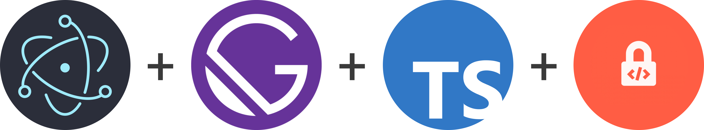

<!-- PROJECT LOGO -->
<br />
<p align="center">
  <a href="https://github.com/github_username/repo_name">
    
  </a>

  <h3 align="center">Create Electron Secure Gatsby</h3>

  <p align="center">
    Electron apps made easy
    <br />
    <br />
    <br />
    ·
    <a href="https://github.com/StiliyanKushev/create-electron-secure-gatsby/issues">Report Bug</a>
    ·
    <a href="https://github.com/StiliyanKushev/create-electron-secure-gatsby/issues">Request Feature</a>
  </p>
</p>


<!-- TABLE OF CONTENTS -->
<details open="open">
  <summary><h2 style="display: inline-block">Table of Contents</h2></summary>
  <ol>
    <li>
      <a href="#about-the-project">About The Project</a>
      <ul>
        <li><a href="#built-with">Built With</a></li>
      </ul>
    </li>
    <li>
      <a href="#getting-started">Getting Started</a>
      <ul>
        <li><a href="#installation">Installation</a></li>
      </ul>
    </li>
    <li><a href="#usage">Usage</a></li>
    <li><a href="#contact">Contact</a></li>
    <li><a href="#acknowledgements">Acknowledgements</a></li>
  </ol>
</details>


<!-- ABOUT THE PROJECT -->
## About The Project

This is a template project that you can download and start building your next electron project, without having to worry about source protection, repeating html, or performance issues.


### Built With

* [Electron](https://www.electronjs.org/)
* [Gatsby](https://www.gatsbyjs.com/)
* [Bytenode](https://www.npmjs.com/package/bytenode)
* [Asarmor](https://www.npmjs.com/package/asarmor)
* [Love <3](https://www.youtube.com/watch?v=-5CdAup0o-I)


<!-- GETTING STARTED -->
## Getting Started

To get a local copy up and running follow these simple steps.

### Installation

1. Clone the repo
   ```sh
   git clone https://github.com/StiliyanKushev/create-electron-secure-gatsby.git
   ```
2. Install NPM packages
   ```sh
   npm install
   ```


<!-- USAGE EXAMPLES -->
## Usage

I've made a set of scripts that will prepare typescript files to js and compile them to bytenode jsc files. Some of the scripts also delete some files you don't need. I also modified the gatsby-node.js file and made it compile all js to jsc and make the original js files as loader files.

All you care about more or less would be these two commands.
```sh
   npm run dev // run gatsby web server and open it in electron
   npm run pack // builds gatsby + electron (compiles to jsc) and applies asarmor.
   ```
Note: after running "npm run pack" and everything is finished, your finished and protected product will be in the /dest folder


<!-- CONTACT -->
## Contact

Name: Stiliyan Kushev
Discord: Stiliyan Kushev#1146
Gmail: stiliyankushev@gmail.com

Project Link: [https://github.com/StiliyanKushev/create-electron-secure-gatsby](https://github.com/StiliyanKushev/create-electron-secure-gatsby)


<!-- ACKNOWLEDGEMENTS -->
## Acknowledgements

* [https://github.com/soulehshaikh99/create-gatsby-electron-app](https://github.com/soulehshaikh99/create-gatsby-electron-app)
* [https://github.com/bytenode/bytenode/tree/master/examples/electron-hello-world](https://github.com/bytenode/bytenode/tree/master/examples/electron-hello-world)
* [https://github.com/electron/electron-quick-start-typescript](https://github.com/electron/electron-quick-start-typescript)
* [https://github.com/sleeyax/asarmor](https://github.com/sleeyax/asarmor)
